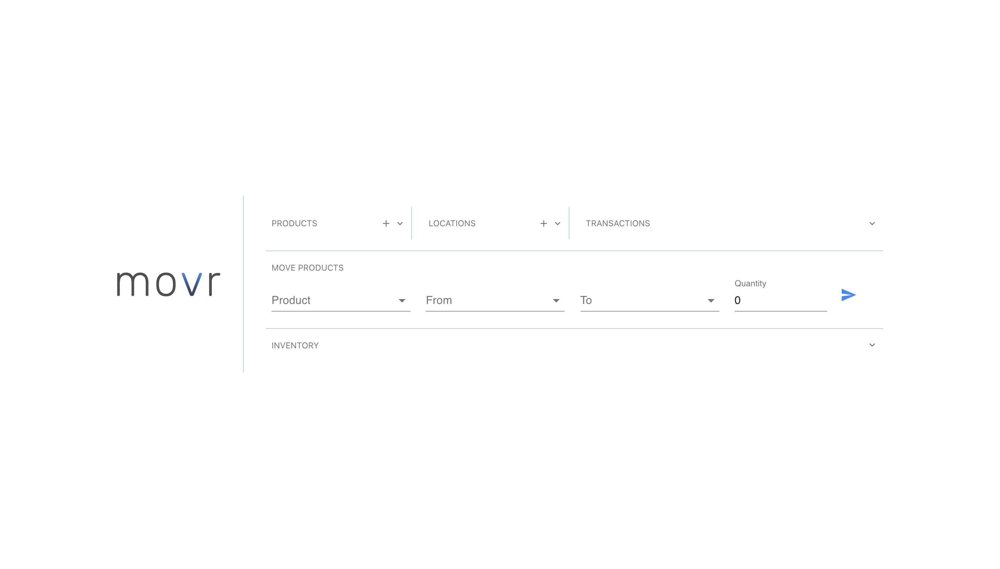

# flask_test_movr

A simple webapp called **`movr`** made using `flask`, `MySQL` for the backend, `React` for the frontend and `Material-UI` for react compoents.

---

## Usage/Function 
- Products are added into a list by clicking the **+** button in the *PRODUCTS* pane, similarly for *LOCATIONS*, 
- Once products or locations are added, they can be deleted and their names can be changed.
- *MOVE PRODUCTS* is used for moving products into a location, or out of a location, or from one location to another, the quantity has to be specified.
- Quantity restraints and tally is maintained by using a MySQL `trigger`.
- *TRANSACTIONS* shows all the product movements, *Elsewhere* denotes one of the locations (either 'from' or 'to') were empty.
- *INVENTORY* shows how much of what product is present at each location.

## Fronend
All panes in the ui can contract and expand except the *MOVE PRODUCTS* section.
- Here all panes have been collpased. 
- All the panes have been expanded and an entry is being made in the locations column. 
- Tooltips show the date and time of a transaction, there's also other stuff like error messages. 

## Backend
- The `create_db.sql` file is used to create the database, tables and trigger.
- A class `DBConnectionHandler` maintains i/o with the database using [PyMySql](https://github.com/PyMySQL/PyMySQL).

## Running the code in dev mode
- **server**
  - Install packages in `requirements.txt` using `pip`.
  - Install MySQL, source the `create_db.sql` file, (the file can alternatively be read and executeed using a python script).
  - Update the `server/.env` file with the appropriate values (see the `os.getenv` calls in `app.py`).
  - `$ flask run`
- **frontend**
  - `$ npm install` to install the packages in `package.json`
  - Edit the `movr/.env` and point it to the flask server address.
  - `$ npm start` to start the front end.